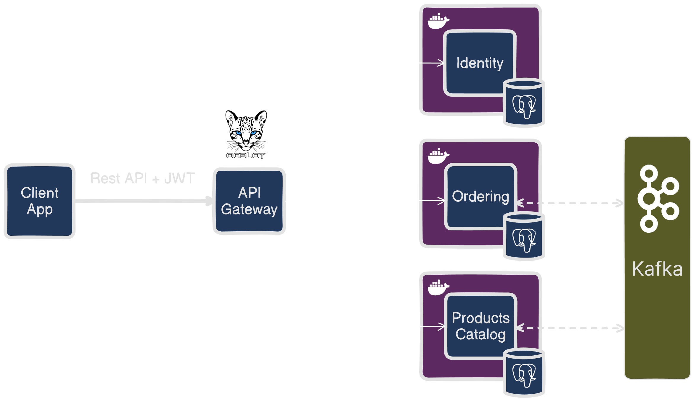

# AnyProduct

The repository contains E-commerce example based on Microservices architecture.

## Setup

The project requires **Docker Compose** in order to run the system in a local computer.

It's recommended to use **Visual Studio 2022** which has native support for Docker projects.

After you open the repository in VS 2022, choose `docker-compose` as a startup project and run. 
**Docker Compose** will compose up applications and launch a swagger page of the gateway. 

## Solution structure

* `AnyProduct.Common` - projects shared among microservices.
	- `AnyProduct.EventBus` - abstractions and base classes for managing event bus.
	- `AnyProduct.EventBus.Kafka` - Kafka implementation for event bus.
	- `AnyProduct.Inbox.EF` - Inbox design pattern implementation using EF core. It provides idempotent consumption of events, it also acts a dead letter storage.
	- `AnyProduct.OutBox.EF` - Outbox design pattern implemetation using EF Core.
* `AnyProduct.Gateway.Api` - provides routing, rate limiting, load balancing and etc. Implemented by **Ocelot**. 
* `AnyProduct.Identity` - identity management service. It provides login and token refresh functionality. Implemented by **ASP.NET Core Identity**.
* `AnyProduct.Orders` - Placing and cancelling orders, cart management. It is designed based on DDD and Clean Architecture.
* `AnyProduct.Products` - Product calatog management. It is designed based on DDD and Clean Architecture.

## Admin Credentials

By Default thre is a generated user with `Administrator` role on startup.

Email: `admin@admin.com`

Password: `Admin123@`

In order to place an order, you need to create a client user. 

